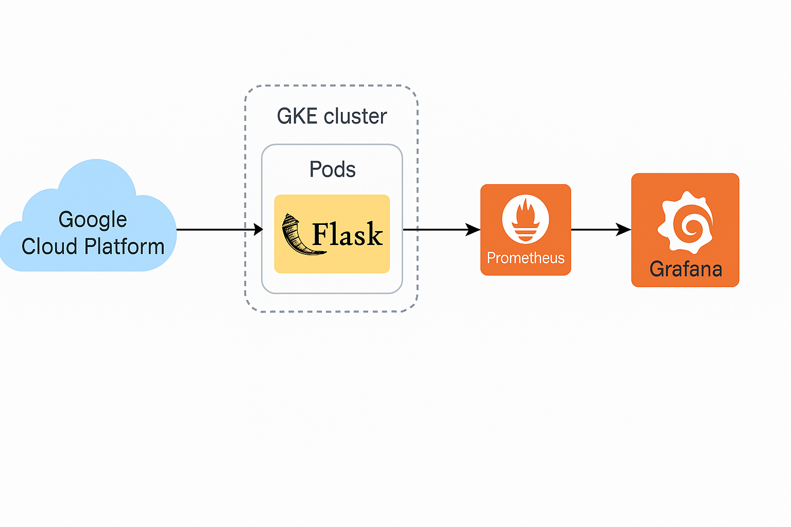

# GCP Kubernetes Monitoring Stack with Prometheus and Grafana

This project sets up a basic GKE (Google Kubernetes Engine) cluster using Terraform and deploys a monitoring stack (Prometheus + Grafana) along with a sample Python web app. It demonstrates core DevOps skills such as infrastructure as code, container orchestration, CI/CD, and observability.

## Stack
- Google Cloud Platform (GKE)
- Terraform (for GKE provisioning)
- Kubernetes (GKE)
- Docker
- Python (Flask app)
- Prometheus & Grafana
- GitHub Actions (CI/CD)

## Testing Instructions

### 1. Provision GKE with Terraform

```bash
cd infra/terraform
terraform init
terraform apply
```

Ensure GCP credentials are set correctly using a service account.

### 2. Deploy Sample App and Monitoring Stack

```bash
cd k8s-app
kubectl apply -f deployment.yaml

cd ../monitoring/prometheus
kubectl apply -f prometheus-config.yaml

cd ../grafana
kubectl apply -f grafana-config.yaml
```

### 3. Port-forward Grafana Dashboard

```bash
kubectl port-forward svc/grafana 3000:3000 -n monitoring
```

Access at `http://localhost:3000` (default creds: admin/admin)

---

## Project Structure

```
.
├── infra/
│   └── terraform/       # GKE infrastructure
├── k8s-app/             # Sample Python web app
├── monitoring/
│   ├── prometheus/      # Prometheus configuration
│   └── grafana/         # Grafana config & dashboards
└── README.md
```

## Use Case Summary
This project demonstrates how a DevOps engineer:
- Provisions cloud infrastructure using Terraform
- Deploys Dockerized applications to Kubernetes
- Sets up observability with Prometheus and Grafana
- Uses GitHub Actions for automation (can be extended)

## Project Workflow


